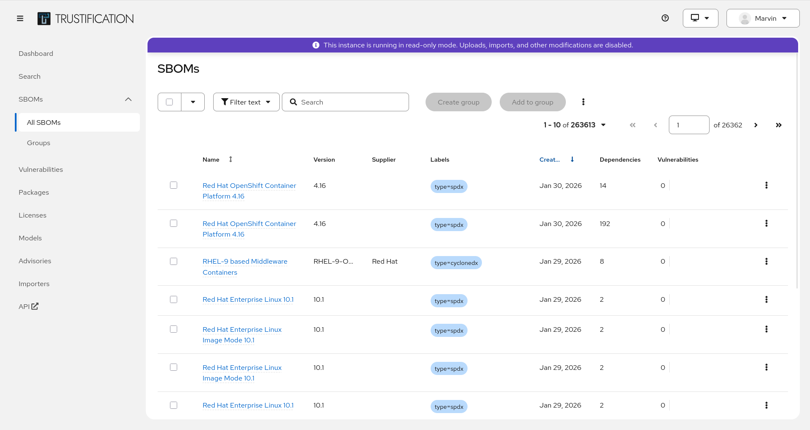
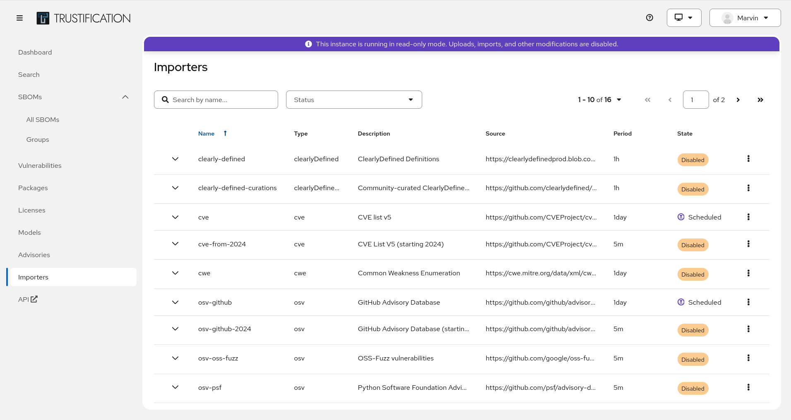

# Trustify

[](https://github.com/guacsec/trustify/actions/workflows/ci.yaml)
[](LICENSE)
[](https://github.com/guacsec/trustify/releases)

**The open-source platform for software supply chain security.**

Trustify brings SBOMs, vulnerability advisories, and VEX documents into a single searchable system — so you can understand what's in your software and respond to threats in minutes, not days.

## Why Trustify

| | |
|---|---|
| **Unified SBOM Management** | Ingest, store, and search CycloneDX and SPDX SBOMs in one place |
| **Vulnerability Intelligence** | Cross-reference SBOMs against advisories from Red Hat, GHSA, NVD, and OSV |
| **VEX Support** | Reduce alert fatigue with vendor vulnerability exploitability data (CSAF/VEX) |
| **Built-in Importers** | Automatically fetch and stay current with public vulnerability feeds |
| **REST API & Web UI** | Full API with OpenAPI spec, plus a modern web interface |
| **Single Binary Deployment** | One binary, one PostgreSQL database — no microservices to wrangle |

## See It In Action

<!-- TODO: Add screenshot of the Trustify dashboard showing SBOM search results -->
<!-- Recommended: 1200x700px PNG, dark and light variants if possible -->



## Quick Start

### Option 1: Download a release

Download the latest `trustd-pm` binary from
[Releases](https://github.com/guacsec/trustify/releases), then:

```shell
AUTH_DISABLED=true ./trustd-pm
```

### Option 2: Build from source

```shell
AUTH_DISABLED=true cargo run --bin trustd
```

This starts Trustify in "PM mode" — an embedded PostgreSQL database is created in `.trustify/` in your current directory. No external setup needed.

- **Web UI:** http://localhost:8080
- **REST API:** http://localhost:8080/openapi/

### Load sample data

```shell
cd etc/datasets && make
curl -X POST http://localhost:8080/api/v3/dataset --data-binary @ds1.zip \
  -H "Content-Type: application/zip"
```

> **Note:** PM mode requires IPv6 enabled with localhost resolving to `::1`.

## Key Concepts

| Term | What it means in Trustify |
|------|--------------------------|
| **SBOM** | A software bill of materials (CycloneDX or SPDX) describing the components in a software product |
| **Advisory** | A security advisory (e.g. from NVD, Red Hat, GHSA) describing vulnerabilities in specific packages |
| **VEX** | Vendor exploitability exchange — a statement from a vendor about whether a vulnerability actually affects their product |
| **pURL** | Package URL — a standard way to identify a software package across ecosystems |
| **CPE** | Common Platform Enumeration — an identifier for products, used in NVD advisories |
| **CVE** | A unique identifier for a publicly known security vulnerability |

## Contributing

We welcome contributions! To get started:

1. [Install Rust](https://www.rust-lang.org/learn/get-started)
2. Start PostgreSQL: `podman-compose -f etc/deploy/compose/compose.yaml up`
3. Run the tests: `cargo test`

See [CONVENTIONS.md](CONVENTIONS.md) for coding standards and
[docs/](docs/) for architecture decisions, OIDC setup, and deployment guides.

## Ecosystem

| Repository | Description |
|------------|-------------|
| [trustify-ui](https://github.com/guacsec/trustify-ui) | Web interface |
| [trustify-helm-charts](https://github.com/guacsec/trustify-helm-charts) | Helm charts for Kubernetes deployment |
| [trustify-mcp](https://github.com/guacsec/trustify-mcp) | MCP server for AI/LLM integration |
| [trustify-load-test-runs](https://github.com/guacsec/trustify-load-test-runs) | Scale test runner and [results](https://guacsec.github.io/trustify-scale-test-runs/) |
| [scale-testing](https://github.com/guacsec/scale-testing) | Scale test suite |
| [trustify-release-tools](https://github.com/guacsec/trustify-release-tools) | Release automation |

## Architecture

Trustify uses a [modulith](https://dzone.com/articles/architecture-style-modulith-vs-microservices)
architecture — a single deployable binary backed by PostgreSQL.

- **REST API** for ingesting and querying supply-chain data
- **Built-in importers** that fetch public vulnerability feeds on a schedule
- **Extensible data model** supporting SBOMs, advisories, VEX, pURLs, and CPEs
- **OIDC authentication** with optional dev/test bypass


## License

Apache-2.0 — see [LICENSE](LICENSE) for details.

