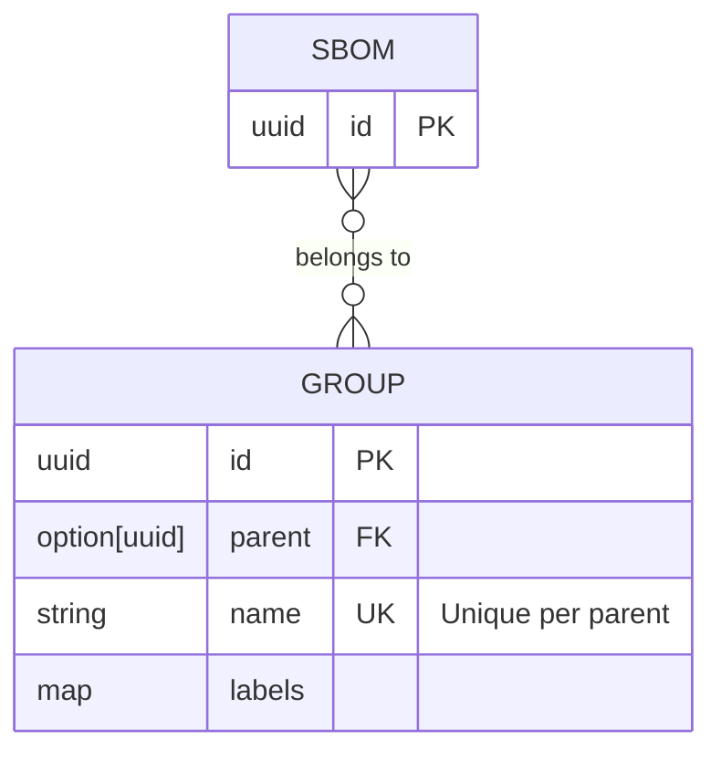

# 00013. Add the ability to group SBOMs

## Status

APPROVED

## Context

In order to better organize SBOMs, we do want to group them. The idea is to start out with a simple "folder style"
hierarchical grouping system.

All groups should be equal. No special meaning. Groups should have a unique name (per parent) and SBOMs can be
assigned to zero or more groups. Groups can have arbitrary key/value style metadata (aka labels).

> [!NOTE]
> Whenever this document talks about "groups", the intention is "SBOM groups". In the future, we may
> have groups for other things as well. Or maybe re-use these groups for other entities. But right now,
> the focus is very much on "groups for SBOMs".

## Details



If a group has a `null` parent, then it is a "root level" group. The "root" is an implicit group, which does
not have additional information.

This would be modeled in SQL like:

```sql
CREATE TABLE SBOM
(
    ID UUID NOT NULL,

    PRIMARY KEY (ID)

    -- omitted other SBOM fields
);

CREATE TABLE SBOM_GROUP
(
    ID        UUID NOT NULL PRIMARY KEY,
    PARENT_ID UUID NULL,
    NAME      TEXT NOT NULL,

    CONSTRAINT FK_PARENT FOREIGN KEY (PARENT_ID) REFERENCES SBOM_GROUP (ID),
    CONSTRAINT UNIQUE_NAME_PER_PARENT UNIQUE (PARENT_ID, NAME)
);

CREATE TABLE SBOM_GROUP_ASSIGNMENT
(
    SBOM_ID  UUID NOT NULL REFERENCES SBOM (ID) ON DELETE CASCADE,
    GROUP_ID UUID NOT NULL REFERENCES SBOM_GROUP (ID) ON DELETE CASCADE,

    PRIMARY KEY (SBOM_ID, GROUP_ID)
);
```

## Decision

### Permissions

The following new permissions will be added:

* `ReadSbomGroup`: Allow reading SBOM groups and group information
* `CreateSbomGroup`: Allow creating new SBOM groups
* `UpdateSbomGroup`: Allow updating existing SBOM groups
* `DeleteSbomGroup`: Allow deleting SBOM groups

### Identifiers & Names

Each group is identified by a unique ID provided by the system. On the API level, the ID should be treated as a string,
and not interpreted in any way.

Each group must also have a name. The name must be unique in the context of a parent.

In general, all names are valid. However, the API will limit the creation/update of names according to the following
rules:

* Names must have a length between 1 and 255 characters
* Names must not start or end with whitespace characters
* Names must only use the following character classes: digits, letters, spaces, `-`, `_`, `.`, `(`, `)`

> [!IMPORTANT]
> Those rules may be relaxed over time. Therefore, it is important that users of the API can deal with group names
> which would violate those rules.
> 
> For example, the system might return a group name which contains a `:` in a future version. Or return a name which
> is longer than 255 characters. This is not considered a breaking change.

### API Data model

```rust
/// The base group information
#[derive(Serialize, Deserialize)]
struct Group {
    id: Uuid,
    #[serde(default, skip_serializing_if = "Option::is_none")]
    parent: Option<Uuid>,
    name: String,
    #[serde(default, skip_serializing_if = "BTreeMap::is_empty")]
    labels: BTreeMap<String, String>,
}
```

```rust
/// The group information, with additional details
#[derive(Serialize, Deserialize)]
struct GroupDetails {
    #[serde(flatten)]
    group: Group,
    /// The number of groups owned directly by this group
    ///
    /// This information is only present when requested. 
    #[serde(default, skip_serializing_if = "Option::is_none")]
    number_of_groups: Option<u64>,
    /// The number of SBOMs directly assigned to this group
    ///
    /// This information is only present when requested. 
    #[serde(default, skip_serializing_if = "Option::is_none")]
    number_of_sboms: Option<u64>,
    /// The path, of IDs, from the root to this group
    ///
    /// This information is only present when requested. 
    #[serde(default, skip_serializing_if = "Option::is_none")]
    parents: Option<Vec<String>>,
}
```

```rust
/// Group information that can be mutated
#[derive(Serialize, Deserialize)]
struct GroupRequest {
    #[serde(default, skip_serializing_if = "Option::is_none")]
    parent: Option<Uuid>,
    name: String,
    #[serde(default, skip_serializing_if = "BTreeMap::is_empty")]
    labels: BTreeMap<String, String>,
}
```

### GET `/api/v2/group/sbom`

Create a new endpoint to find groups.

* Get all groups
* Get all groups, limited by filter criteria

By default, the entries will be sorted by name ascending.

#### Request

| part  | name      | type       | description                                                  |
|-------|-----------|------------|--------------------------------------------------------------|
| query | `q`       | "q" string | "q style" query string                                       |
| query | `totals`  | boolean    | Provide sums of child groups and linked SBOMs for each entry |
| query | `parents` | boolean    | Provide IDs from root to this group                          |
| query | `limit`   | u64        | Maximum number of items to return                            |
| query | `offset`  | u64        | Initial items to skip before actually returning results      |

The following `q` parameters are supported:

* `name`: Filters groups by their name. Be aware that names are only unique in the context of their parent. It may be
  that multiple groups with the same name exist globally.
* `parent`: The ID of the parent to limit the search to. This can only perform an "equals" check.

#### Response

* 200 - if the user is allowed to read groups

  ```rust
  #[derive(Serialize, Deserialize)]
  struct PaginatedGroup {
      total: u64,
      items: Vec<GroupDetails>,
  }
  ```

  The `number_of_groups` and `number_of_sboms` fields will only be present if the `totals` query parameter
  was `true`.

  The `parents` field will only be present if the `parents` query parameter was `true`. It might still be
  an empty array if the group is a top-level group.

* 401 - if the user was not authenticated
* 403 - if the user was authenticated but not authorized

### GET `/api/v2/group/sbom/<id>`

Create a new endpoint to get group information.

#### Response

* 200 - if the group was found

  | part    | name   | type    | description                        |
  |---------|--------|---------|------------------------------------|
  | body    | -      | `Group` | The group information              |
  | headers | `ETag` | string  | Value which indicates the revision |

* 401 - if the user was not authenticated
* 404 - if the group was not found or the user doesn't have permission to read this group

### GET `/api/v2/group/sbom-by-path/<path>`

Create a new endpoint to find a group by its hierarchy of names (aka path).

#### Request

| part | name   | type     | description                                 |
|------|--------|----------|---------------------------------------------|
| path | `path` | `String` | The path (see delimiter and escaping below) |

The path (list of names) is provided as a string. The delimiter is `/`. This
means that slashes in names have to be escaped. Slashes can be escaped by
prefixing them with a backslash `\`. A literal backslash is escaped as well,
turning it into a double backslash. Also note, the resulting string must be
URL encoded as well.

For example, the path `A`, `B/1`, `C\2` should be located. This would result
in a string of `A/B\/1/C\\2`, which would then be URL encoded as `A%2FB%5C%2F1%2FC%5C%5C2`.

#### Response

* 400 - if the request could not be understood
* 401 - if the user was not authenticated
* 403 - if the user was authenticated but not authorized
* 404 - if no group with that path was found
* 200 - if the group was found

  | part    | name   | type    | description                        |
  |---------|--------|---------|------------------------------------|
  | body    | -      | `Group` | The group information              |
  | headers | `ETag` | string  | Value which indicates the revision |

### POST `/api/v2/group/sbom`

Create a new endpoint for creating new groups.

#### Request

| part | name | type           |
|------|------|----------------|
| body | -    | `GroupRequest` |

#### Response

* 400 - if the request could not be understood
* 400 - if the name of the group is not allowed
* 401 - if the user was not authenticated
* 403 - if the user was authenticated but not authorized
* 409 - if the group name is not unique within the parent
* 201 - the group was created

  ```yaml
  id: <id> # ID of the created group
  ```

  And:

  ```
  Location: /api/v2/group/sbom/<id>
  ```

### PUT `/api/v2/group/sbom/<id>`

Create a new endpoint for updating existing groups.

This operation would allow changing the parent. This allows for creating a cycle in the
hierarchy which is no longer reachable from the root. This must be prevented, so each time
the parent is changed, it must be ensured that no cycle is being created by that change.
In case a cycle would be created, the operation must fail with a `409` status code.

#### Request

| part   | name      | type             | Description                    | 
|--------|-----------|------------------|--------------------------------|
| body   | -         | `GroupRequest`   | The new content                |
| header | `IfMatch` | `Option<String>` | ETag value, revision to update | 

#### Response

* 400 - if the request could not be understood
* 400 - if the name of the group is allowed
* 401 - if the user was not authenticated
* 403 - if the user was authenticated but not authorized
* 409 - if the group name is not unique within the parent
* 409 - if using that parent would create a cycle
* 412 - if the `IfMatch` header was present, but its value didn't match the stored revision
* 204 - the group was updated

### DELETE `/api/v2/group/sbom/<id>`

Create a new endpoint for deleting existing groups.

Deleting a group will remove all SBOM assignments to that group.

#### Request

| part   | name      | type             | description                    |
|--------|-----------|------------------|--------------------------------|
| path   | `id`      | `String`         | ID of the group to delete      |
| header | `IfMatch` | `Option<String>` | ETag value, revision to delete | 

#### Response

* 204 - if the group was successfully deleted
* 204 - if the group was already deleted
* 400 - if the request could not be understood
* 401 - if the user was not authenticated
* 403 - if the user was authenticated but not authorized
* 409 - if the group has child groups (and no delete recursion should happen)
* 412 - if the `IfMatch` header was present, but its value didn't match the stored revision

### GET `/api/v2/group/sbom-assignment/<id>`

Create a new endpoint to get SBOM group assignment.

#### Request

| part   | name      | type             | description                    |
|--------|-----------|------------------|--------------------------------|
| path   | `id`      | `String`         | ID of the SBOM                 |

#### Response

* 400 - if the request could not be understood
* 401 - if the user was not authenticated
* 403 - if the user was authenticated but not authorized
* 404 - if no SBOM with that ID was found
* 200 - if the SBOM was found

  | part    | name   | type          | description                        |
  |---------|--------|---------------|------------------------------------|
  | body    | -      | `Vec<String>` | The current SBOM group assignments |
  | headers | `ETag` | string        | Value which indicates the revision |

### PUT `/api/v2/group/sbom-assignment/<id>`

Create a new endpoint to assign an SBOM to groups.

#### Request

| part   | name      | type             | description                    |
|--------|-----------|------------------|--------------------------------|
| path   | `id`      | `String`         | ID of the SBOM to update       |
| header | `IfMatch` | `Option<String>` | ETag value, revision to delete | 
| body   | -         | `Vec<String>`    | Group IDs to set               |

#### Response

* 204 - if the SBOM was successfully updated
* 400 - if the request could not be understood
* 401 - if the user was not authenticated
* 403 - if the user was authenticated but not authorized
* 412 - if the `IfMatch` header was present, but its value didn't match the stored revision

### GET `/api/v2/sbom`

Extend existing endpoint for finding SBOMs to limit search by group.

* Add a parameter `group`, which can be a set of group IDs. The parameter can be used more than
  once, SBOMs being part of this set are returned.

  This will only return SBOMs which have any of this group assigned.

  If the parameter is present, but empty, there will be no filter on groups.

### POST `/api/v2/sbom`

Extend existing endpoint to assign the newly uploaded SBOM to a list of groups (by id).

* Add the parameter `group`, allow zero or more groups to be present, assigning the
  SBOM to those groups after they have been ingested. This requires the "ID" of the group.
  So the user might need to look up groups in a previous step.

* 400 - if the user provided one or more group IDs which are not valid. In this case
  the document will not be ingested

## Consequences

* We provide access to the described APIs
* There should be no performance degradation of existing APIs

## Open questions

* Do we automatically delete groups recursively

## Future tasks

* Build a UI on top of the API
* Consider using `ltree` as a cached name, making it easier to filter and find the chain to the root
